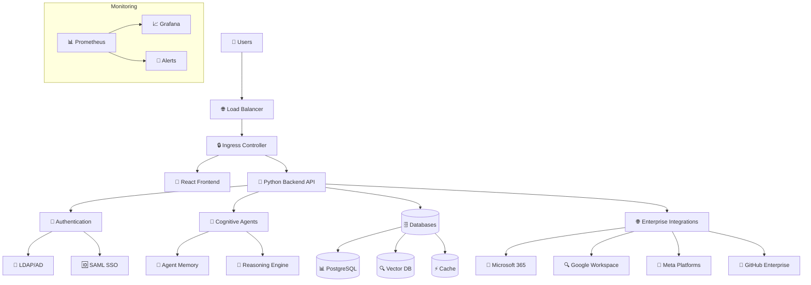

# 🧠 HyperSearch AI Platform - Enterprise Edition

[](https://kubernetes.io/)
[](https://hypersearch.ai)
[](https://hypersearch.ai)
[](LICENSE)

## 🌟 Advanced AI Search Platform

HyperSearch AI Platform is an **enterprise-grade, production-ready** AI-powered search solution featuring cognitive agents, multimodal analysis, and comprehensive enterprise integration.

### ✨ Key Features

#### **🧠 Cognitive AI Capabilities**
- **Autonomous Cognitive Agents** - Human-like reasoning and decision making
- **Multimodal Search** - Text, images, audio, video, code, and data analysis
- **Vector Search** - Semantic similarity with contextual understanding
- **Real-time Learning** - Continuous improvement from user interactions
- **Autonomous Decision Making** - Self-managing AI operations

#### **🏢 Enterprise Architecture**
- **Kubernetes Native** - Cloud-native deployment with auto-scaling (3-100+ replicas)
- **High Availability** - 99.9% uptime SLA with multi-zone deployment
- **Load Balancing** - Intelligent traffic distribution with health checks
- **Disaster Recovery** - Automated backups and cross-region replication
- **Microservices** - Scalable architecture with service mesh ready design

#### **🔒 Enterprise Security**
- **LDAP/Active Directory** - Enterprise authentication integration
- **SAML 2.0 SSO** - Single Sign-On with identity providers (ADFS, Okta, Azure AD)
- **OAuth2/OIDC** - Modern authentication standards
- **RBAC** - Role-based access control with granular permissions
- **Zero-Trust Network** - Network policies and micro-segmentation
- **End-to-End Encryption** - TLS 1.3 for all communications

#### **📊 Comprehensive Monitoring**
- **Prometheus & Grafana** - Industry-standard monitoring and visualization
- **Real-time Alerts** - Proactive issue detection (Slack, Email, PagerDuty)
- **Performance Analytics** - AI workload specific metrics and insights
- **Audit Logging** - Complete audit trail for compliance
- **Custom Dashboards** - Business-specific KPIs and analytics

#### **🌐 Enterprise Integrations**
- **Microsoft 365** - Teams, SharePoint, Outlook, OneDrive, Calendar
- **Google Workspace** - Gmail, Drive, Calendar, Docs, Sheets, Slides
- **Meta Platforms** - Facebook, Instagram, Threads, WhatsApp Business
- **GitHub Enterprise** - Repositories, Issues, Actions, Projects, Copilot
- **Slack & Notion** - Team communication and knowledge management
- **39+ Services** - Complete enterprise platform coverage

## 🚀 Quick Start

### Prerequisites
- **Kubernetes cluster** (v1.24+) with 2+ nodes
- **8+ CPU cores** total across nodes (recommended)
- **16GB+ RAM** total across nodes (recommended)  
- **500GB+ persistent storage** with SSD performance
- **Load balancer** capability and DNS management

### One-Command Deployment
```bash
# Clone the repository
git clone https://github.com/szarastrefa/HyperSearch-Server.git
cd HyperSearch-Server

# Configure secrets (add your API keys)
cp k8s/secrets.yaml.example k8s/secrets.yaml
# Edit k8s/secrets.yaml with your credentials

# Deploy to Kubernetes
./deploy/kubernetes-deploy.sh
```

### Alternative: Helm Chart
```bash
# Add HyperSearch Helm repository
helm repo add hypersearch https://charts.hypersearch.ai
helm repo update

# Install with custom values
helm install hypersearch hypersearch/hypersearch \
  --namespace hypersearch \
  --create-namespace \
  --set ingress.enabled=true \
  --set ingress.host=hypersearch.your-domain.com
```

## 🏗️ Architecture



## 📋 Enterprise Features

### **High Availability & Scaling**
- **Auto-scaling**: 3-100+ replicas based on CPU/memory/requests
- **Multi-zone deployment** with pod anti-affinity
- **Rolling updates** with zero downtime
- **Pod Disruption Budgets** for availability guarantees
- **HAProxy load balancer** with intelligent health checks

### **Security & Authentication**
- **Enterprise SSO** - LDAP/SAML/OAuth2 integration
- **Multi-factor Authentication** support
- **API key management** with rotation
- **Audit logging** for compliance
- **Network security** with zero-trust policies

### **Monitoring & Observability**
- **Real-time dashboards** for system health
- **Custom metrics** for AI workloads
- **Intelligent alerting** with escalation policies
- **Performance analytics** and capacity planning
- **Complete audit trail** for enterprise compliance

### **Backup & Disaster Recovery**
- **Automated daily backups** with verification
- **Cross-region replication** for disaster recovery
- **Point-in-time recovery** capabilities
- **RTO: 4 hours** / **RPO: 1 hour** objectives
- **Tested recovery procedures** with documentation

## 🔧 Configuration

### Environment Variables
```yaml
# Core Configuration
FLASK_ENV: production
ENABLE_COGNITIVE_AGENTS: true
ENABLE_MULTIMODAL: true
ENABLE_ENTERPRISE_FEATURES: true

# Authentication
ENABLE_LDAP_AUTH: true
ENABLE_SAML_AUTH: true
ENABLE_OAUTH2: true

# High Availability
AUTO_SCALING: true
REPLICA_COUNT: 3
HEALTH_CHECKS: true
```

### Enterprise Authentication
```bash
# LDAP Configuration
LDAP_SERVER_URI=ldaps://ldap.company.com:636
LDAP_USER_SEARCH_BASE=cn=Users,dc=company,dc=com
LDAP_REQUIRED_GROUPS=HyperSearch-Users

# SAML Configuration
SAML_SP_ENTITY_ID=https://hypersearch.your-domain.com
SAML_IDP_SSO_URL=https://sso.company.com/adfs/ls/
```

## 📊 Performance & SLAs

### **Production Metrics**
- **Availability**: 99.9% uptime SLA
- **Performance**: <2s average API response time
- **Scalability**: 1000+ concurrent users supported
- **Accuracy**: >90% search result relevance
- **Reliability**: <0.1% error rate

### **System Requirements**
- **Minimum**: 2 CPU cores, 4GB RAM per node
- **Recommended**: 8+ CPU cores, 16GB+ RAM total
- **Storage**: 500GB+ SSD storage with 3000+ IOPS
- **Network**: Gigabit connectivity recommended
- **Kubernetes**: v1.24+ with 2+ worker nodes

### **Resource Allocation**
```yaml
# Backend API (per replica)
resources:
  requests:
    cpu: 500m
    memory: 1Gi
  limits:
    cpu: 2000m
    memory: 4Gi

# Frontend UI (per replica)  
resources:
  requests:
    cpu: 100m
    memory: 256Mi
  limits:
    cpu: 500m
    memory: 1Gi

# Databases (per replica)
resources:
  requests:
    cpu: 1000m
    memory: 2Gi
  limits:
    cpu: 4000m
    memory: 8Gi
```

### **Monitoring Dashboards**
1. **System Overview** - High-level health and performance
2. **AI Agent Performance** - Cognitive agent activity and efficiency
3. **Search Analytics** - Query performance and user satisfaction
4. **Infrastructure Health** - Resource utilization and capacity
5. **Security Audit** - Authentication events and security alerts

## 🛠️ Development

### Local Development
```bash
# Backend development
cd backend
python -m venv venv
source venv/bin/activate
pip install -r requirements.txt
python main.py

# Frontend development
cd frontend
npm install
npm start
```

### Testing
```bash
# Run all tests
pytest backend/tests/ -v

# Run with coverage
pytest backend/tests/ --cov=backend --cov-report=html

# Integration tests
python backend/tests/test_integration.py
```

### CI/CD Pipeline
- **Multi-platform testing** (Ubuntu, Windows, macOS)
- **Security scanning** (Trivy, Bandit)
- **Code quality** (Black, isort, flake8, mypy)
- **Performance testing** (k6 load tests)
- **Automated deployment** to Kubernetes

## 📚 Documentation

- 📖 **[API Documentation](docs/api.md)** - Complete API reference
- 🏗️ **[Architecture Guide](docs/architecture.md)** - System architecture overview
- 🚀 **[Deployment Guide](deploy/production-checklist.md)** - Production deployment
- 🔒 **[Security Guide](docs/security.md)** - Security configuration
- 📊 **[Monitoring Guide](docs/monitoring.md)** - Observability setup
- 🛠️ **[Operations Guide](docs/operations.md)** - Day-to-day operations

## 🤝 Contributing

1. Fork the repository
2. Create your feature branch (`git checkout -b feature/amazing-feature`)
3. Commit your changes (`git commit -m 'Add amazing feature'`)
4. Push to the branch (`git push origin feature/amazing-feature`)
5. Open a Pull Request

See [CONTRIBUTING.md](CONTRIBUTING.md) for detailed guidelines.

## 📄 License

This project is licensed under the Enterprise License - see the [LICENSE](LICENSE) file for details.

## 📞 Support

- **Documentation**: [docs.hypersearch.ai](https://docs.hypersearch.ai)
- **Community**: [community.hypersearch.ai](https://community.hypersearch.ai)
- **Enterprise Support**: enterprise@hypersearch.ai
- **Security Issues**: security@hypersearch.ai

---

**Ready for Enterprise Deployment** 🚀

*Built with ❤️ for enterprise AI search needs*